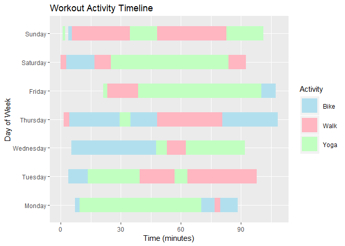
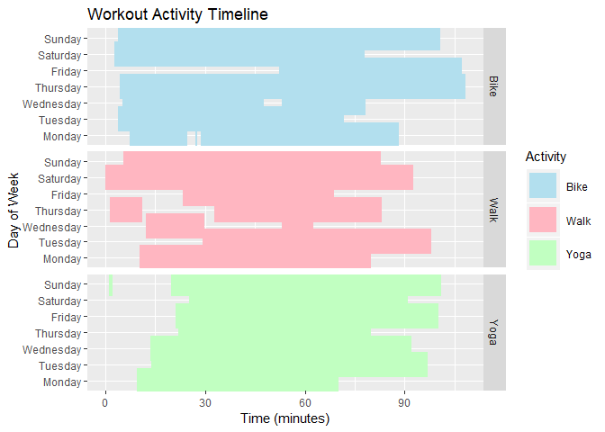
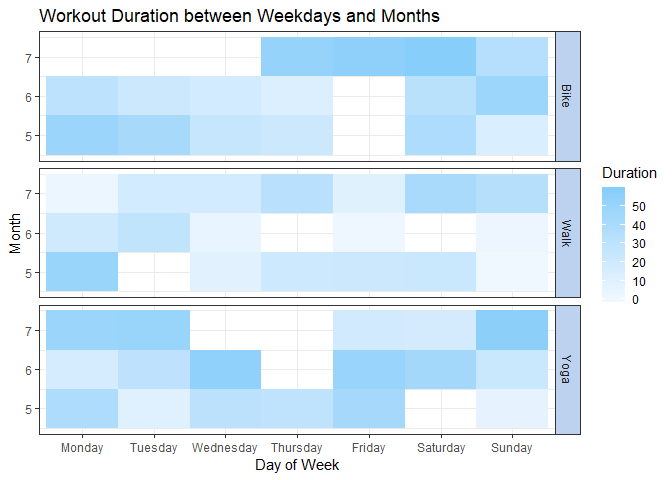

Workout Activities Visualisation
================================

  - [Prerequisites](#prerequisites)

``` r
library(openxlsx)
library(lubridate)
library(magrittr)
library(dplyr)
library(ggplot2)
```

### Prerequisites

We try to reproduce the output in this article with our own dummy data
<https://medium.com/@jeffgriesemer/creating-timeline-charts-in-r-my-fitness-activity-58eeb14af3df>

``` r
ggplot(data) +
  geom_segment(aes(x=start_time, xend=end_time, y=DOW, yend=DOW, color=Activity), size=10) +
  scale_color_manual(values = c("Bike"="lightblue2", "Walk"="lightpink", "Yoga"="darkseagreen1")) +
  labs(x="Time (minutes)", y="Day of Week", title="Workout Activity Timeline") 
```



> Generally the bars shoudldn’t elapsed.
Since this is dummy data, this will happen. From this plot we can
observe how long each activity takes between weekdays.

``` r
ggplot(data) +
  geom_segment(aes(x=start_time, xend=end_time, y=DOW, yend=DOW, color=Activity), size=10) +
  scale_color_manual(values = c("Bike"="lightblue2", "Walk"="lightpink", "Yoga"="darkseagreen1")) +
  labs(x="Time (minutes)", y="Day of Week", title="Workout Activity Timeline") +
  facet_grid(Activity~.)
```



> If we separate the activities, we can
further identify each exercise activities.

``` r
ggplot(data, aes(DOW, month)) + 
  geom_tile(aes(fill = duration)) + 
  scale_fill_gradient(low = "aliceblue", high = "lightskyblue") +
  labs(x="Day of Week", y="Month", title="Workout Duration between Weekdays and Months", fill="Duration") +
  facet_grid(Activity~.) +
  theme_bw() +
  theme(strip.background = element_rect("lightsteelblue2")) 
```



> We user another technique to examine
the duration of each activity. We can see that this person tends to
exercise a lot in July, particularly riding bikes or doing yoga.
